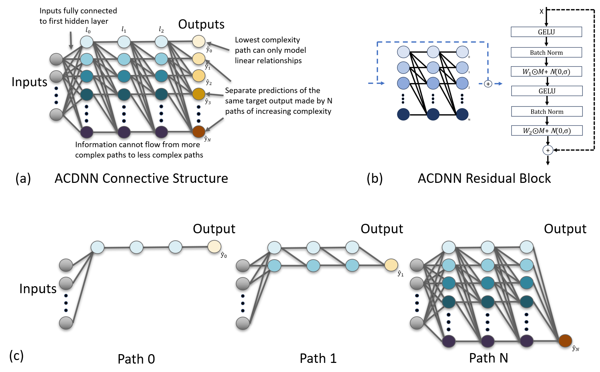
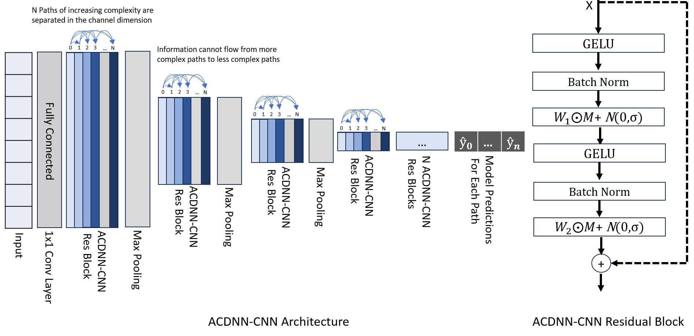
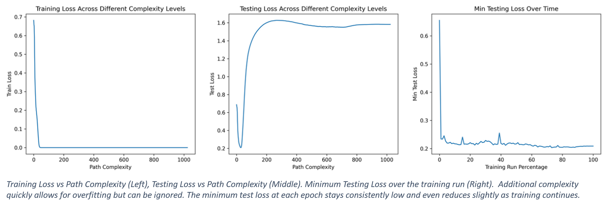

# ACDNN
Adaptive Complexity Deep Neural Networks: A CNN architecture designed specifically to avoid overfitting on small biomedical datasets. Intended for small 1D, 2D, and 3D datasets.

## ARCHITECTURE
ACDNNs simultaneously are broken into overlapping sub-networks which each make separate predictions. Simple sub-networks struggle to fit the data but do not overfit. Complex sub-networks easily fit the data but may overfit. This allows ACDNNs to learn to solve the problem at many different complexity levels simultaneously. The amount of model complexity which generalizes best can then be identified at evaluation time, rather than trying to guess it before training begins.

## ARCHITECTURE AS A CNN
For use in CNNs, the ACDNN connective restriction is modified to work in the channel dimension.

## ACDNN Training

## USAGE
See [the demo notebook](ACDNN-CNN-3D-demo.ipynb) for an example of usage.
